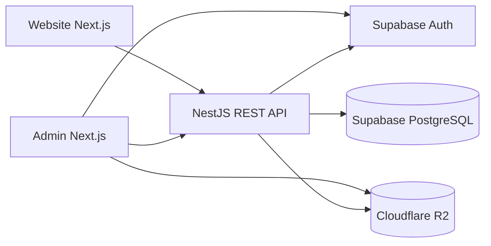

# Kiến trúc hệ thống

Hệ thống gồm ba ứng dụng độc lập: `web-xeluottoantrung` (Next.js 15), `admin-xeluottoantrung` (Next.js 16), và `api-xeluottoantrung` (NestJS/Fastify). API là nơi duy nhất thực hiện nghiệp vụ và truy cập PostgreSQL. Admin đăng nhập bằng Supabase Auth; website công khai không cần đăng nhập.

API dùng Drizzle ORM và pool kết nối PostgreSQL dùng lại giữa các request. Global prefix là `/api/v1`; Swagger ở `/api/docs`. JWT Supabase được xác minh bởi API, sau đó profile, role và permission trong DB quyết định quyền ở từng endpoint. Thao tác ghi quan trọng tạo `audit_logs`.

Ảnh xe/asset đi thẳng từ trình duyệt admin lên R2 qua URL PUT có chữ ký do API cấp. Admin sau đó đăng ký metadata ảnh qua API. Website chỉ nhận public URL; `GET /cars` lấy ảnh đại diện, `GET /cars/:slug` lấy toàn bộ gallery.

Website đọc API trên server cho xe, danh mục, SEO, bài viết, FAQ, đánh giá, showroom và một số thiết lập. Route động dùng server rendering; fetch công khai được cache 30 giây. Các snapshot HTML cũ chỉ còn làm khuôn giao diện và nội dung thông tin chưa được quản lý trong admin. Xe cũ không có trong API không được xuất bản lại từ snapshot.

Các bảng và quan hệ được liệt kê trong [database-schema.md](database-schema.md). Hợp đồng HTTP xem [api-design.md](api-design.md); mapping frontend xem [frontend-integration.md](frontend-integration.md).

Không có catalog phụ kiện, thuật toán định giá tự động hoặc provider tra cứu phạt nguội trong UI/API hiện tại. Biểu mẫu bán và lên đời xe tạo lead để nhân viên xử lý.
