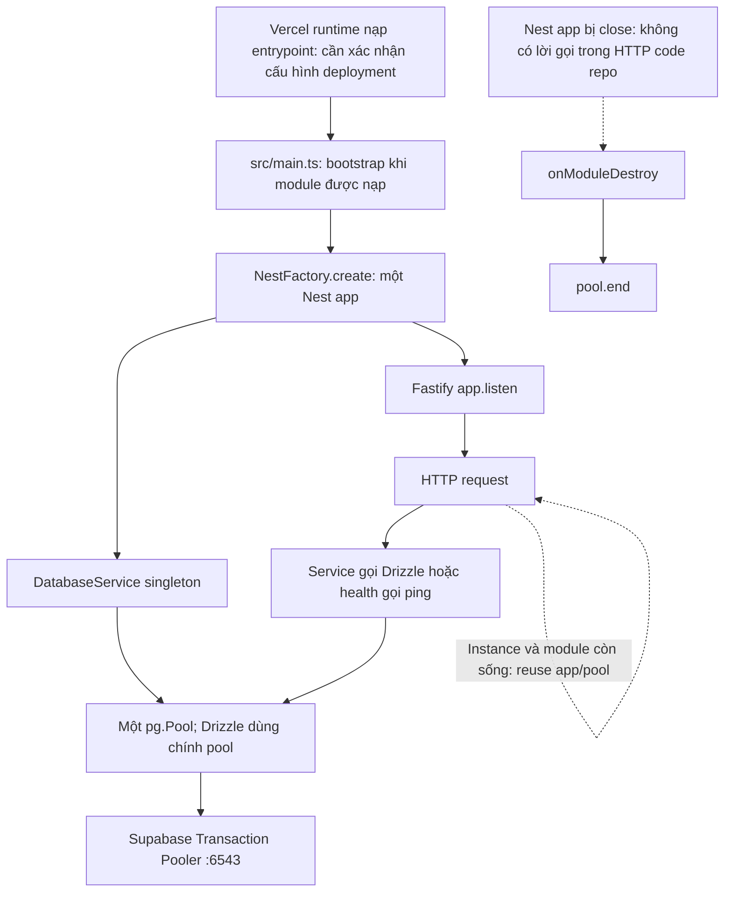

# Database diagnostics: NestJS, Vercel, Supabase Transaction Pooler

Phạm vi: kiểm tra mã trong repo và bổ sung logging. Chưa có runtime log hay cấu hình deployment Vercel để xác nhận nguyên nhân lỗi production.

## Kết quả kiểm tra lifecycle

| Điểm kiểm tra | File và dòng | Kết quả |
| --- | --- | --- |
| Entry point | `src/main.ts:121`, `src/main.ts:122` | Gọi `bootstrap()` khi module được nạp và `NODE_ENV !== 'test'`. |
| Tạo Nest app | `src/main.ts:22` | Một `NestFactory.create(AppModule, FastifyAdapter, ...)` trong bootstrap; không nằm trong HTTP handler. |
| Bắt đầu nhận HTTP | `src/main.ts:113` | `app.listen(...)`; app là biến local của bootstrap. |
| Khai báo DatabaseService | `src/database/database.module.ts:5` | Provider singleton mặc định, không có request scope. |
| Tạo pool và Drizzle | `src/database/database.service.ts:15`, `src/database/database.service.ts:24` | Một pool cho mỗi DatabaseService; Drizzle dùng chính pool đó. |
| Đóng pool của Nest app | `src/database/database.service.ts:41`, `src/database/database.service.ts:42` | Chỉ trong `onModuleDestroy()`. |
| Endpoint đang lỗi | `src/modules/content/content.controller.ts:20`, `src/modules/content/content.service.ts:58` | Controller gọi `settings()`, service dùng `database.db.select()`; không tạo hay đóng pool. |
| Health | `src/modules/health/health.controller.ts:20`, `src/modules/health/health.controller.ts:23` | Gọi `ping()`, lỗi gốc được giữ trong cause của exception 503. |

Không thấy custom Vercel handler, `export default` app/handler, `api/` entrypoint, `vercel.json`, hay cache app/promise được viết trong repo. Các `export default` tìm thấy là config ESLint và Drizzle (`eslint.config.js:4`, `drizzle.config.ts:4`).

Vercel hỗ trợ phát hiện NestJS từ `src/main.ts` và mẫu `bootstrap()`/`app.listen()`, nên thiếu custom handler không phải bằng chứng entrypoint sai. Nếu deployment đang dùng cơ chế native này, wrapper/handler nằm trong output do Vercel sinh. Cấu hình deployment và wrapper đó chưa được kiểm tra. Nguồn: [NestJS on Vercel](https://vercel.com/docs/frameworks/backend/nestjs), [Vercel hướng dẫn triển khai NestJS](https://vercel.com/kb/guide/ship-a-nestjs-app-on-vercel).

Không có code tạo lại Nest app/DatabaseService trên mỗi request, không gọi `app.close()` trong production source, không gọi thủ công `onModuleDestroy()` trong production source, và không có cache chứa một app đã đóng. Việc reuse giữa invocation phụ thuộc instance/module của runtime còn sống; repo không có app cache tường minh và không cung cấp bằng chứng về wrapper production.

## Các vị trí đóng pool khác

Các script sau tạo pool riêng rồi đóng pool riêng. Không thấy module/controller/service HTTP import các script này.

| Script | Tạo pool | Đóng pool |
| --- | --- | --- |
| `src/database/ping.ts` | 7 | 16 |
| `src/database/check-auth-user.ts` | 10 | 34 |
| `src/database/seed/bootstrap-admin.ts` | 13 | 28 |
| `src/database/seed/call-contacts.ts` | 14 | 24 |
| `src/database/seed/recruitment-article.ts` | 11 | 15 |
| `src/database/seed/roles-permissions.ts` | 46 | 66 |
| `src/database/seed/seo-website.ts` | 14 | 39 |
| `src/database/seed/website-content.ts` | 42 | 57 |
| `src/database/seed/website-settings.ts` | 35 | 43 |
| `src/modules/media/retry-deletes.ts` | 13 | 34 |

Các `NestFactory.create()`/`app.close()` ngoài main chỉ nằm trong test:

| Test | Tạo app | Đóng app |
| --- | --- | --- |
| `test/auth.test.ts` | 70 | 93 |
| `test/cars.test.ts` | 134 | 178 |
| `test/lookups.test.ts` | 88 | 119 |
| `test/phase7.test.ts` | 124 | 153 |

Test diagnostic mới tạo DatabaseService tại `test/database-diagnostics.test.ts:76` và gọi `onModuleDestroy()` tại dòng 84 để cleanup. Không mở kết nối DB thật trong test này. Các test PGlite khác dùng `pg.close()` để cleanup DB test.

Đã tìm toàn bộ source, test và config, kể cả file ẩn, với `pool.end(`, `.end()`, `app.close(`, `onModuleDestroy(`, `new DatabaseService(`, `NestFactory.create(`, handler/export mặc định, request scope, shutdown hooks và client release. Bỏ qua dependencies, build output, `.git`, lockfile và file env để tránh đưa credentials vào kết quả tìm kiếm. Không thấy `.end()`/client close bổ sung trong HTTP flow.

## Thay đổi logging

| File và dòng | Thay đổi |
| --- | --- |
| `src/common/logging/safe-error-details.ts:38` | Chỉ lấy name/message/code/stack; lấy cùng các trường ở tối đa ba tầng cause, dừng vòng tham chiếu. |
| `src/common/logging/safe-error-details.ts:9` | Che PostgreSQL URL, credentials tách từ URL, giá trị biến môi trường chứa password/token/secret/key/credential, Bearer/JWT và các cặp secret=value. |
| `src/common/logging/safe-error-details.ts:48` | Che SQL và params trong message/stack của lỗi `Failed query:` do Drizzle nhúng trực tiếp. Không serialize query/params/client/pool options. |
| `src/common/logging/pino-logger.service.ts:9` | Thay serializer err mặc định của Pino để giữ cause có name/code/stack; serializer mặc định có thể gộp message/stack và bỏ cause. |
| `src/common/logging/pino-logger.service.ts:17` | Giữ payload lỗi Nest dạng object; dùng msg cố định để Pino không tự sao chép err.message chưa được che vào msg. |
| `src/database/database.service.ts:21` | Listener `pool.on('error', ...)`: event `database.pool.error`, lỗi an toàn và trạng thái pool. |
| `src/database/database.service.ts:27` | Snapshot totalCount/idleCount/waitingCount và ending/ended để phát hiện pool đã bị đóng. |
| `src/common/filters/api-exception.filter.ts:24` | HTTP 5xx ghi requestId/method/path/status, err và pool snapshot. Path bỏ query string. |
| `src/main.ts:123` | Lỗi bootstrap cũng đi qua helper che dữ liệu nhạy cảm. |

Listener pool chủ yếu bắt lỗi client idle/background; lỗi query HTTP đi qua exception filter. Các lỗi được business logic xử lý thành 4xx hoặc được bắt và không ném lại sẽ không có log 5xx từ filter. Không bọc/patch Drizzle, pool.query hoặc client.query.

Snapshot pool là trạng thái lúc logging, có thể sau khi pg đã remove/release client hoặc một request khác đã thay đổi pool. Nó không chứng minh trạng thái ngay trước lỗi và không hiển thị số kết nối backend bên trong Supabase pooler.

## Các điểm cần đối chiếu với log production

- Code hiện tại dùng `max: 1` tại `src/database/database.service.ts:17`, khác bối cảnh max 3. Giữ nguyên giá trị để diagnostic không thay đổi hành vi. Queue có thể hình thành khi nhiều API gọi DB cùng lúc; cần đối chiếu waitingCount và lỗi timeout, chưa thể kết luận là nguyên nhân.
- Pool listener trước đây chưa được gắn. Lỗi client idle trước đây có thể thành unhandled error event; thay đổi mới giúp ghi lỗi và giữ event được xử lý.
- Nếu log có `ending: true`/`ended: true` và lỗi dùng pool sau end, kiểm tra lifecycle thực tế trong wrapper/deployment vì HTTP source hiện tại không có đường đóng pool.
- Nếu nguyên nhân gốc là timeout, đối chiếu waitingCount/totalCount/idleCount. Không tự retry hay đổi timeout/pool sizing trong lần sửa này.
- Nếu nguyên nhân gốc là mất kết nối/socket hoặc PostgreSQL SQLSTATE, dùng name/message/code/stack trong chuỗi cause để phân biệt. Chưa xác nhận loại lỗi nào xảy ra trên production.
- `idleTimeoutMillis` của pg có thể đóng từng client nhàn rỗi rồi tạo client khác khi cần; việc này khác với kết thúc cả pool bằng `pool.end()`.
- Pool tạo client khi cần query. `totalCount: 0` tự nó không có nghĩa pool đã đóng; cần đọc thêm ending/ended và lỗi gốc.

Không đổi schema, migration, business logic, bootstrap lifecycle hoặc cấu hình pool.

## Kiểm tra

`npm.cmd run typecheck`, `npm.cmd run build`, `npm.cmd run lint` và `npm.cmd test` đều thành công: 18 test pass, gồm 5 test diagnostic mới. Các test diagnostic kiểm tra giới hạn/vòng cause, che dữ liệu nhạy cảm, JSON thật từ Pino, pool error event, và response/log của lỗi HTTP 500 cùng health 503.
